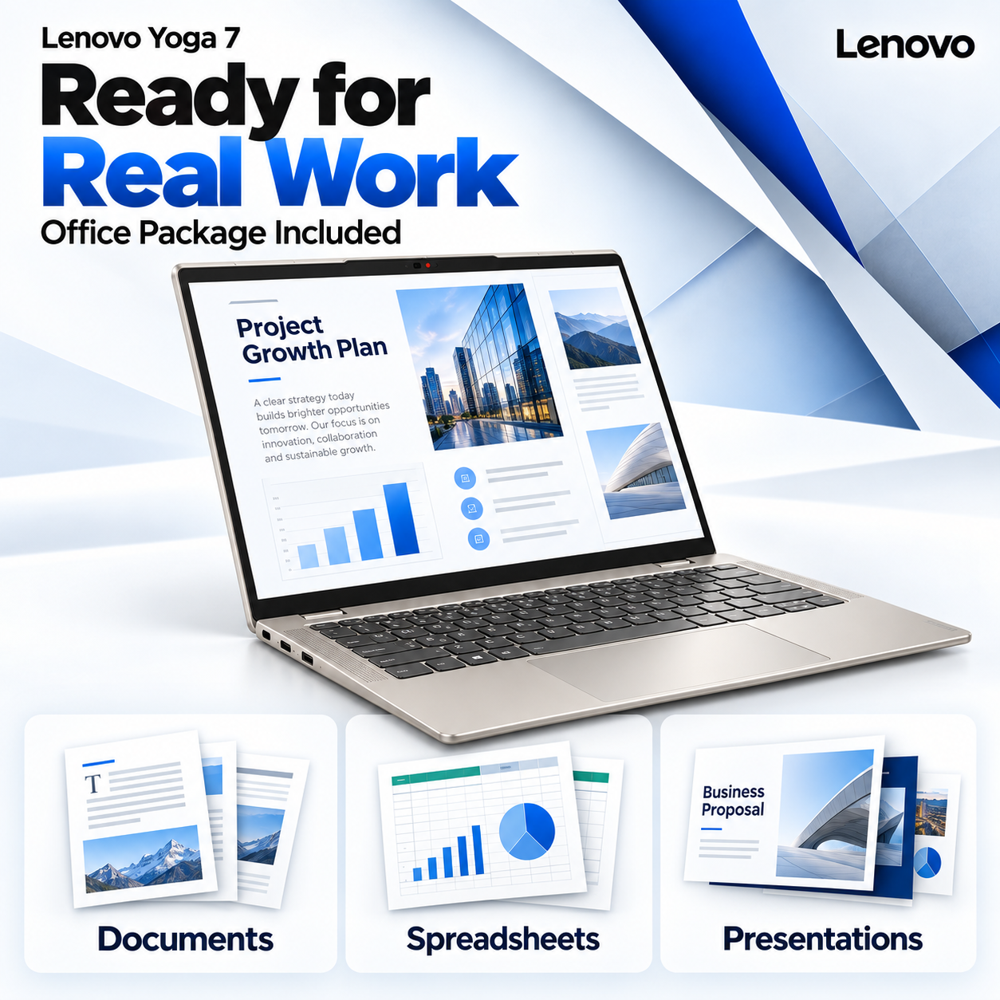
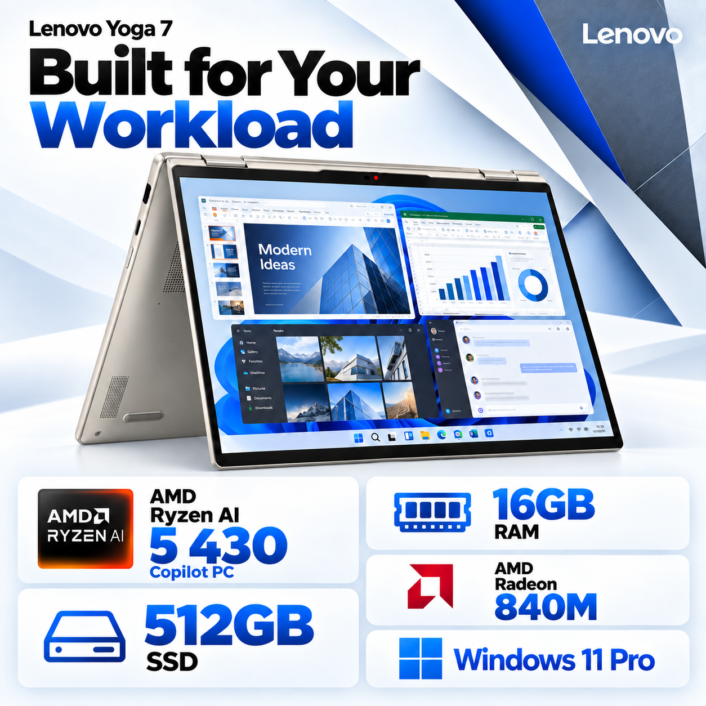
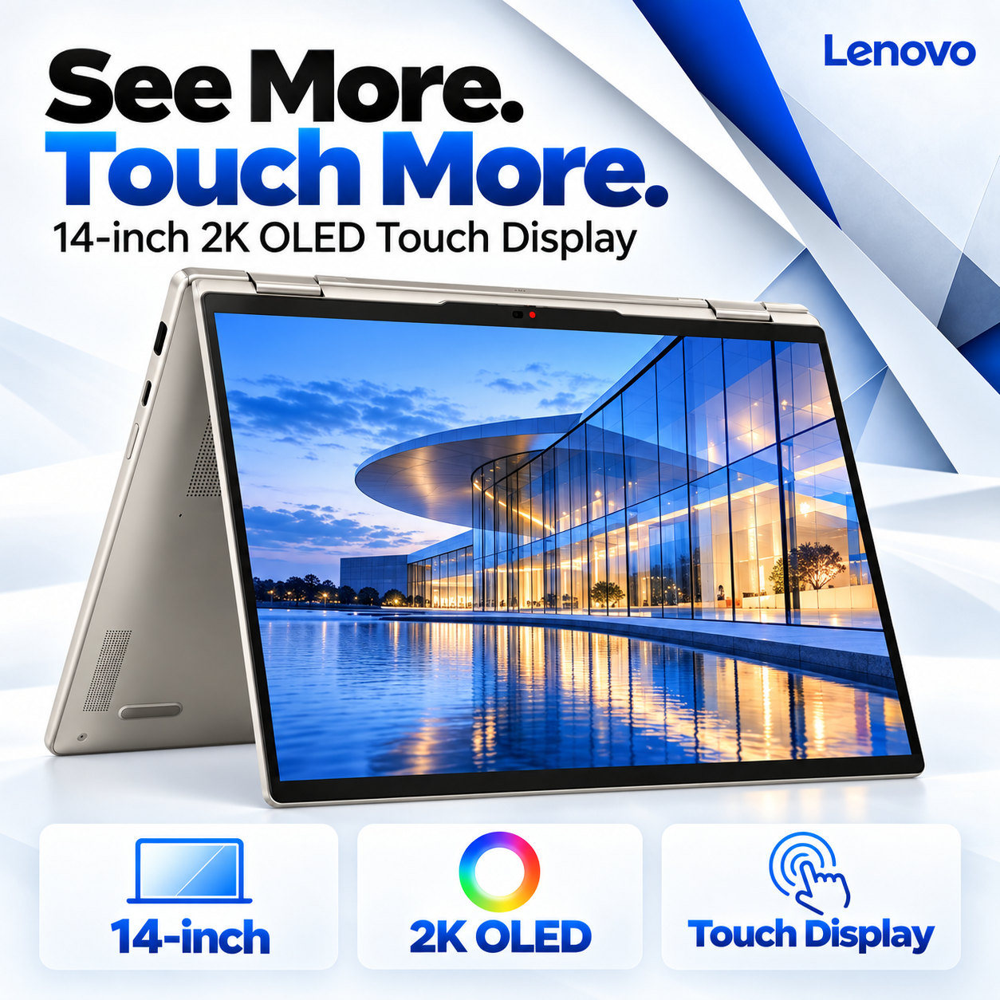
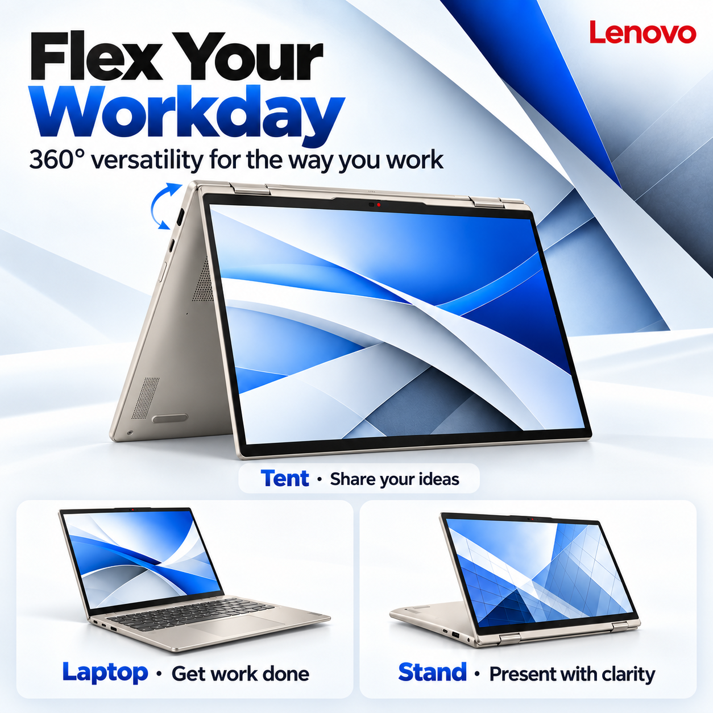
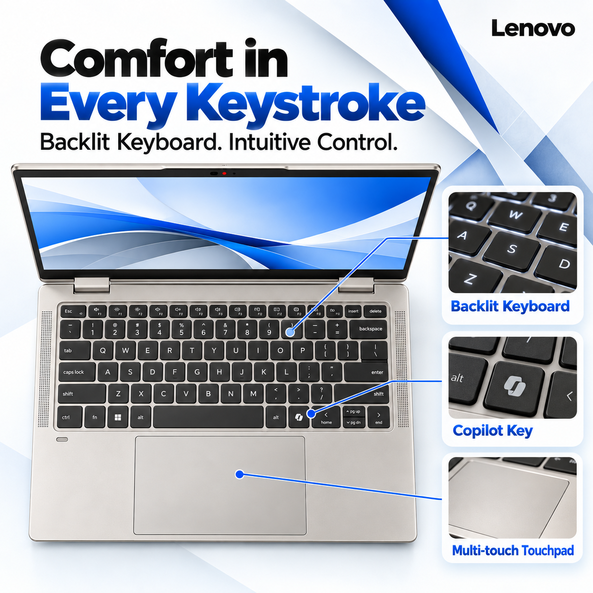
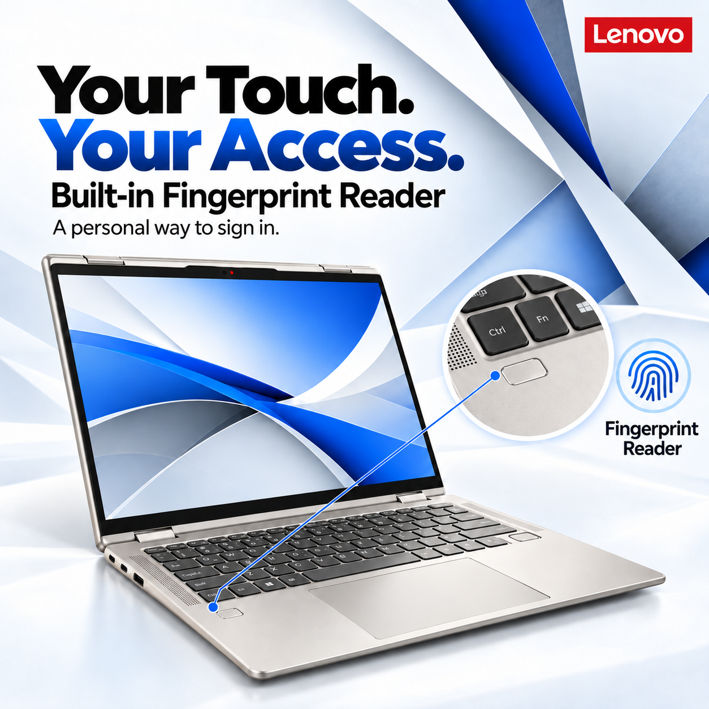
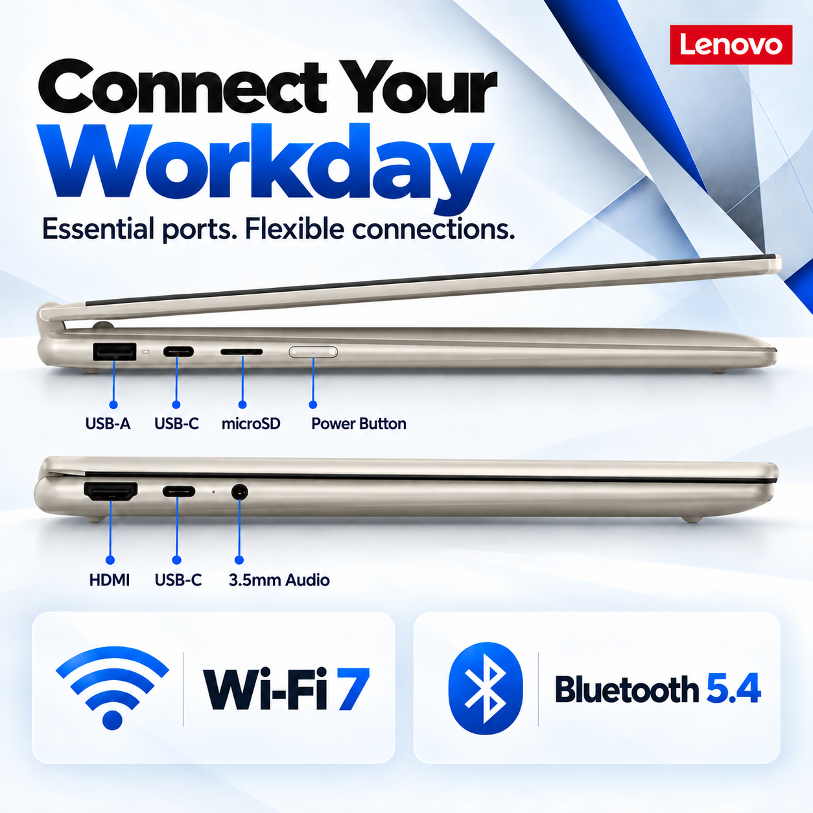

# VL-1326 — 银白＋商务蓝 AI 附图

已按本次批准的 B03/BG03 适配方向生成八张独立附图。采用内置 image_gen，以用户主图和已批准预览为外观/风格参考，并做定点修正。配置为用户确认的 16GB RAM＋512GB SSD。

**这是 AI 仿真效果图，不是实拍或精确机身复刻。原生尺寸均为 1254×1254；没有放大冒充 2000×2000，也没有声明正式图库 QA 或上架资格通过。旧主图、旧附图和长期规则未修改。**

## PT01 — Office 办公价值

Ready for Real Work

## PT02 — 办公使用场景

Make Every Task Clear

## PT03 — 核心配置与 Copilot PC

Built for Your Workload

## PT04 — OLED 触控显示

See More. Touch More.

## PT05 — 360° 多模式使用

Flex Your Workday

## PT06 — 背光键盘与输入

Comfort in Every Keystroke

## PT07 — 指纹识别

Your Touch. Your Access.

## PT08 — 接口和无线连接

Connect Your Workday

## 制作记录

- [本次授权、配置确认、要点分配及检查边界](approval-and-review.json)
- [原始提示词及定点修改提示词](prompts.json)
- [原生文件尺寸、格式及 SHA-256](native-file-checks.json)

PT08 参考 [Lenovo 官方 PSREF](https://psref.lenovo.com/syspool/Sys/PDF/Yoga/Yoga_7_2_in_1_14AGP11/Yoga_7_2_in_1_14AGP11_Spec.pdf) 的接口视图。键盘、铰链及传感器细节仍属 AI 仿真，不能把效果图当成硬件位置的独立证据。Office Package / Copilot PC 按用户确认的主图内容沿用，不扩写终身授权或付费服务。

